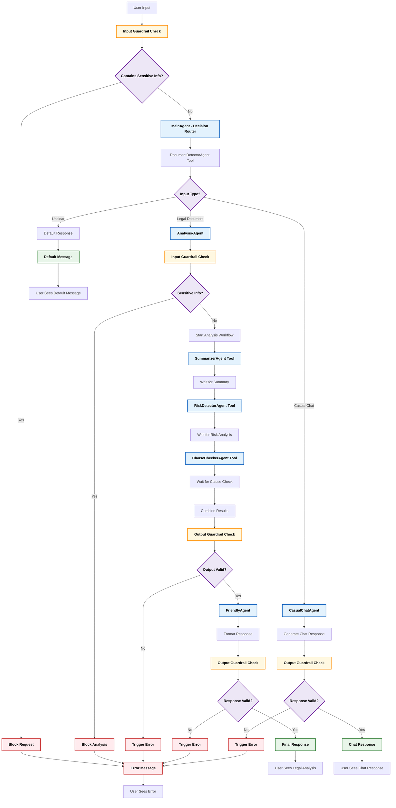

# 🧠 Legalyze AI Agent

## 📄 Overview

**Legalyze AI Agent** is an intelligent legal assistant designed to streamline the process of understanding legal documents and engaging in casual legal-related conversations.

Built with a robust, modular **agent-based architecture**, this system can:

* 🔍 Automatically detect whether the input is a legal document or a casual query
* 📑 Analyze legal documents to provide summaries, detect risks, and offer clause verdicts
* 💬 Engage in friendly chat for general legal inquiries
* 🛡️ Use intelligent guardrails to ensure safe and appropriate interactions (e.g. sensitive data detection)

This project showcases a **multi-agent system** in Python, with a strong emphasis on clear separation of concerns and robust error handling.

---

## ✨ Features

* **Intelligent Input Routing**
  Determines whether input is for document analysis or casual chat.

* **Comprehensive Legal Analysis**
  Summarizes documents, identifies risks, and checks clauses.

* **Conversational AI**
  Handles general legal questions and informal interactions.

* **Sensitive Data Guardrails**
  Prevents processing of sensitive personal information.

* **Modular Agent Design**
  Each function handled by a specialized AI agent.

---

## ⚙️ Project Setup

### ✅ Prerequisites

* Python 3.9+
* [`uv`](https://github.com/astral-sh/uv) (Fast Python package manager)

Install `uv` if not already installed:

```bash
# Linux/macOS:
curl -LsSf https://astral.sh/uv/install.sh | sh

# Windows (PowerShell):
powershell -c "irm https://astral.sh/uv/install.ps1 | iex"
```

---

### 📦 Installation

```bash
git clone <your-repository-url>
cd <your-project-directory>

# Create virtual environment and install dependencies
uv venv
uv pip install -r requirements.txt
```

> If you don't have `requirements.txt` yet, run:

```bash
uv add openai pydantic python-dotenv
uv pip freeze > requirements.txt
```

---

### 🔐 Environment Variables

Create a `.env` file in your root directory:

```env
GEMINI_API_KEY="YOUR_GEMINI_API_KEY_HERE"
```

> ✅ `.env` is already in `.gitignore` — don’t commit it.

---

## 🚀 How to Run

```bash
uv run main.py
```

You’ll be able to interact with your Legalyze AI Agent via the terminal.

---

## 🧭 Project Flow Diagram



---

## 🔍 Flow Explanation

### 🛂 1. Input Guardrail

Scans input for sensitive data. If found → **blocked**.

### 🤖 2. Main Agent - Decision Router

Routes input to the right agent (Document or Chat) using `DocumentDetectorAgent`.

### 📑 3. Legal Document Flow

* Re-checks sensitive data
* Runs:

  * `SummarizerAgent`
  * `RiskDetectorAgent`
  * `ClauseCheckerAgent`
* Validates final response
* Formats via `FriendlyAgent`

### 💬 4. Casual Chat Flow

* Response generated by `CasualChatAgent`
* Final output guardrails applied

### ❔ 5. Unclear Input

* Shows a default message.

### ❌ 6. Errors

* Any blocked or invalid step shows user-friendly error messages.

---

## 🗂 Code Structure

| File                    | Purpose                                                  |
| ----------------------- | -------------------------------------------------------- |
| `main.py`               | Entry point. Orchestrates input → agent routing          |
| `model.py`              | Defines the Gemini/OpenAI model                          |
| `pydantic_models.py`    | All structured input/output schemas                      |
| `agent_instructions.py` | System prompts for agents                                |
| `agents_definitions.py` | Defines and initializes all agents                       |
| `guardrails.py`         | All input/output guardrails (e.g. sensitive data checks) |
| `Logger.py`             | Logging utility for tracking agent behavior              |

---
